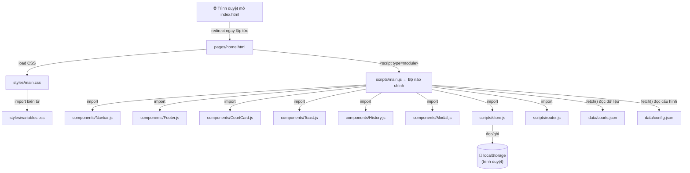

# 🏟️ SportHub — Giải thích toàn bộ dự án

## Các em đã dùng những gì?

| Công nghệ | Dùng để làm gì |
|---|---|
| **HTML** | Tạo cấu trúc/bộ khung của từng trang |
| **CSS thuần (Vanilla CSS)** | Thiết kế giao diện, màu sắc, bố cục, animation |
| **JavaScript ES6 Modules** | Xử lý logic, điều hướng, lọc dữ liệu, tương tác người dùng |
| **JSON** | Lưu trữ dữ liệu sân (tĩnh, không cần server) |
| **localStorage** | Lưu lịch sử đặt sân ngay trong trình duyệt |
| **Leaflet.js** (thư viện ngoài) | Hiển thị bản đồ tương tác ở trang Tìm sân |
| **Unsplash** (ảnh online) | Nguồn ảnh sân thể thao cho giao diện |

> **Không cần server, không cần database, không cần framework** — Toàn bộ chạy bằng file HTML/CSS/JS thuần trên trình duyệt.

---

## Sơ đồ cấu trúc thư mục

```
sporthub/
├── index.html              ← Cổng vào (tự động redirect sang home.html)
│
├── pages/                  ← Các trang chính
│   ├── home.html           ← Trang chủ
│   ├── search.html         ← Trang tìm sân
│   ├── booking.html        ← Trang đặt sân
│   └── profile.html        ← Trang lịch sử / hồ sơ
│
├── scripts/                ← Logic JavaScript
│   ├── main.js             ← Bộ não chính (xử lý mọi trang)
│   ├── store.js            ← Quản lý dữ liệu (localStorage)
│   ├── router.js           ← Điều hướng trang
│   └── home.js             ← Logic phụ trang chủ (nếu có)
│
├── components/             ← Các thành phần UI tái sử dụng
│   ├── Navbar.js           ← Thanh điều hướng trên cùng
│   ├── Footer.js           ← Chân trang
│   ├── CourtCard.js        ← Thẻ sân thể thao
│   ├── History.js          ← Thẻ lịch sử đặt sân
│   ├── Modal.js            ← Hộp thoại popup
│   ├── Toast.js            ← Thông báo nhanh
│   └── SportFilter.js      ← Bộ lọc môn thể thao
│
├── styles/                 ← CSS
│   ├── variables.css       ← Bảng màu & biến dùng chung
│   ├── main.css            ← Toàn bộ style của website
│   └── components.css      ← Style riêng cho components
│
└── data/                   ← Dữ liệu tĩnh (thay database)
    ├── courts.json         ← Danh sách ~20 sân thể thao
    └── config.json         ← Cấu hình chung (quận, môn thể thao...)
```

---

## Cách các file kết nối với nhau



---

## Cách mỗi trang hoạt động — Chi tiết

### 1. 🏠 Trang Chủ (`home.html`)

**Câu hỏi: Ai render Navbar? Ai hiển thị danh sách sân?**

```
home.html tải → <script type="module" src="../scripts/main.js">
                        ↓
              main.js đọc body data-page="home"
                        ↓
              main.js gọi hàm initHome()
                        ↓
     ┌─────────────────────────────────────────────────┐
     │  1. setupNavbar("home")  →  Navbar.js tạo HTML  │
     │  2. setupFooter()        →  Footer.js tạo HTML  │
     │  3. fetch(courts.json)   →  lấy dữ liệu sân     │
     │  4. renderCourtCard(c)   →  CourtCard.js vẽ thẻ │
     │  5. Typing animation     →  Hiệu ứng chữ gõ     │
     └─────────────────────────────────────────────────┘
```

**Luồng người dùng click "Đặt ngay":**
```
Người dùng click "Đặt ngay" trên court-card
    → main.js lắng nghe event click (data-id="c1")
    → window.location.href = "./booking.html?id=c1"
    → Trang booking nhận id từ URL
```

---

### 2. 🔍 Trang Tìm Sân (`search.html`)

**Câu hỏi: Bản đồ từ đâu ra? Tìm kiếm hoạt động thế nào?**

```
search.html tải Leaflet.js từ CDN (thư viện bản đồ miễn phí)
    ↓
main.js gọi hàm initSearch()
    ↓
    ┌─────────────────────────────────────────────────────────┐
    │  1. fetch(courts.json) lấy danh sách sân               │
    │  2. Đọc URL params (?q=pickleball&sport=Tennis)         │
    │  3. Lọc courts[] theo: tên / quận / môn / giá          │
    │  4. renderCourtCard() → vẽ thẻ sân lên #searchResults  │
    │  5. L.map() → khởi tạo bản đồ Hà Nội (Leaflet.js)     │
    │  6. Mỗi sân có lat/lng → thêm marker lên bản đồ        │
    └─────────────────────────────────────────────────────────┘
```

**Cơ chế lọc (filter):** Mỗi lần người dùng thay đổi bộ lọc, JS đọc lại tất cả filter hiện tại và chạy `.filter()` trên mảng courts[], rồi re-render lại danh sách.

---

### 3. 📅 Trang Đặt Sân (`booking.html`)

**Câu hỏi: Biết sân nào để hiển thị? Lịch trống từ đâu?**

```
URL: booking.html?id=c1
    ↓
main.js gọi initBooking()
    ↓
    ┌────────────────────────────────────────────────────────────┐
    │  1. Đọc URL: urlParams.get('id') → "c1"                   │
    │  2. Tìm trong courts.json → tìm sân có id="c1"            │
    │  3. Hiển thị gallery ảnh (theo môn thể thao của sân)      │
    │  4. Render lưới giờ (06:00 → 22:00, 17 khung giờ)        │
    │  5. Tính giờ bận: dùng công thức "seed" + localStorage    │
    │  6. Người dùng click giờ → thêm vào Set selectedSlots     │
    │  7. Click "Tiếp tục" → saveBooking() vào localStorage     │
    │  8. Chuyển sang profile.html                              │
    └────────────────────────────────────────────────────────────┘
```

**localStorage lưu gì?**
```javascript
// store.js quản lý 3 "ngăn tủ" trong localStorage:
"sporthub_booking"      → đơn hàng vừa đặt (tạm thời)
"sporthub_history"      → lịch sử tất cả đơn đã đặt
"sporthub_booked_slots" → các khung giờ đã bị đặt (để tô xám)
```

---

### 4. 👤 Trang Hồ Sơ / Lịch Sử (`profile.html`)

**Câu hỏi: Lấy lịch sử từ đâu? Nút "Lọc" hoạt động thế nào?**

```
main.js gọi initProfile()
    ↓
    ┌──────────────────────────────────────────────────────────────┐
    │  1. getBooking() → lấy đơn mới nhất từ localStorage         │
    │     → hiển thị "Đặt sân đang hoạt động"                    │
    │                                                              │
    │  2. getHistory() → lấy lịch sử thật từ localStorage         │
    │     + mockHistory (4 đơn mẫu cố định)                       │
    │     → fullHistory = real + mock                              │
    │                                                              │
    │  3. History.js vẽ:                                           │
    │     - renderHistoryStats()  → 3 ô thống kê (tổng/hoàn/huỷ) │
    │     - renderHistoryFilters() → ô lọc tìm kiếm               │
    │     - createBookingHistoryCard() → thẻ từng đơn             │
    │                                                              │
    │  4. Click "Xem chi tiết" → Modal.js mở popup                │
    │  5. Click "Đặt lại" → chuyển sang booking.html?id=...       │
    └──────────────────────────────────────────────────────────────┘
```

---

## Giải thích các Components (thành phần tái sử dụng)

| Component | Chức năng | Được dùng ở đâu |
|---|---|---|
| **Navbar.js** | Tạo thanh nav bằng JS, tự highlight trang hiện tại | Tất cả trang |
| **Footer.js** | Tạo chân trang | Tất cả trang |
| **CourtCard.js** | Tạo HTML thẻ sân (ảnh, tên, giá, nút Đặt) | Home, Search |
| **History.js** | Tạo thẻ lịch sử đặt sân + stats + filters | Profile |
| **Modal.js** | Tạo popup hộp thoại | Profile (xem chi tiết) |
| **Toast.js** | Tạo thông báo nhanh (kiểu "snackbar") | Booking (validation) |
| **SportFilter.js** | Bộ lọc môn thể thao (nhỏ, chưa dùng nhiều) | Search |

**Cơ chế Component hoạt động:**
```javascript
// Component KHÔNG phải class hay framework — chỉ là hàm trả về chuỗi HTML
export function renderNavbar(currentPage) {
    return `<nav>...<a class="${currentPage === 'home' ? 'is-active' : ''}">...</a>...</nav>`;
}

// Trang HTML chỉ có container rỗng:
<header id="app-nav"></header>

// main.js bơm HTML vào:
document.getElementById("app-nav").innerHTML = renderNavbar("home");
```

---

## Cơ chế CSS — Cách thiết kế hoạt động

```
variables.css     ← Định nghĩa bảng màu & kích thước dùng chung
      ↓ (được import trong)
main.css          ← Tất cả style: layout, cards, animations, responsive
components.css    ← Style riêng cho modal, toast, history cards
```

**Màu chủ đạo** được định nghĩa 1 chỗ duy nhất:
```css
:root {
  --color-primary: #0f9d76;   /* Xanh lá chủ đạo */
  --color-accent:  #f9be00;   /* Vàng nhấn */
  --color-bg:      #f4f7fb;   /* Nền xám nhẹ */
}
```
→ Toàn bộ website dùng các biến này, muốn đổi màu chỉ cần sửa 1 chỗ.

---

## Luồng người dùng hoàn chỉnh (End-to-End)

```
[Mở trình duyệt]
      ↓
index.html → redirect → home.html
      ↓
[Xem trang chủ, thấy sân nổi bật]
      ↓
[Click "Tìm sân" hoặc tag môn thể thao]
      ↓
search.html?sport=Pickleball
[Lọc sân, xem bản đồ]
      ↓
[Click "Đặt ngay" trên thẻ sân]
      ↓
booking.html?id=c1
[Chọn ngày → chọn sân con → chọn giờ → click "Tiếp tục"]
      ↓
[store.js lưu đơn vào localStorage]
      ↓
profile.html
[Hiển thị đơn vừa đặt + toàn bộ lịch sử]
      ↓
[Click "Xem chi tiết" → Modal.js mở popup]
[Click "Đặt lại" → quay về booking.html]
```

---

## Tóm tắt — "Bí quyết" của dự án

1. **Không cần backend**: Dữ liệu sân lưu trong `courts.json`, lịch sử lưu trong `localStorage` của trình duyệt.
2. **Component pattern**: Mỗi phần UI (Navbar, Card, Modal...) là một file JS riêng, trả về chuỗi HTML → giúp tái sử dụng và dễ maintain.
3. **Phân trang bằng file HTML**: Mỗi trang là 1 file `.html` riêng, dùng URL params (`?id=c1`) để truyền dữ liệu giữa các trang.
4. **main.js là "bộ điều phối"**: Nó đọc `data-page` trên `<body>`, biết đang ở trang nào, rồi gọi đúng hàm `initHome()`, `initSearch()`, `initBooking()`, `initProfile()`.
5. **ES6 Modules**: Dùng `import/export` để chia nhỏ code, tránh file khổng lồ.
